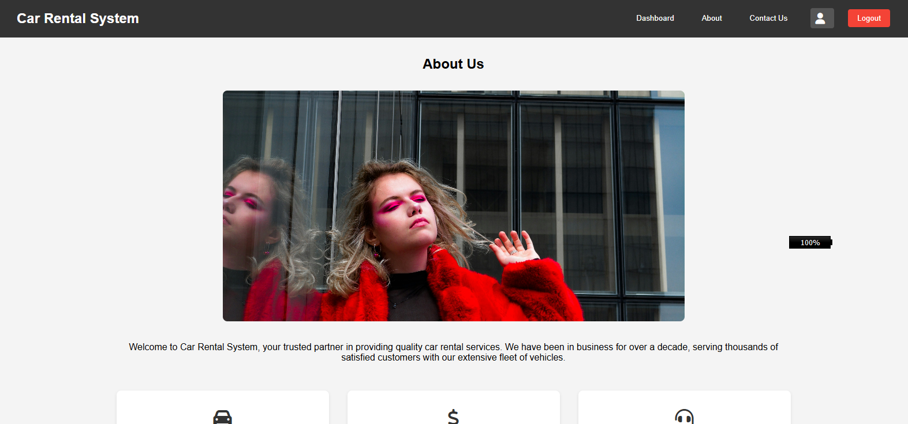
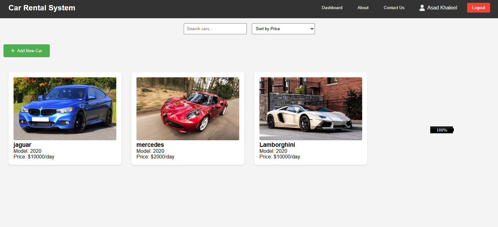
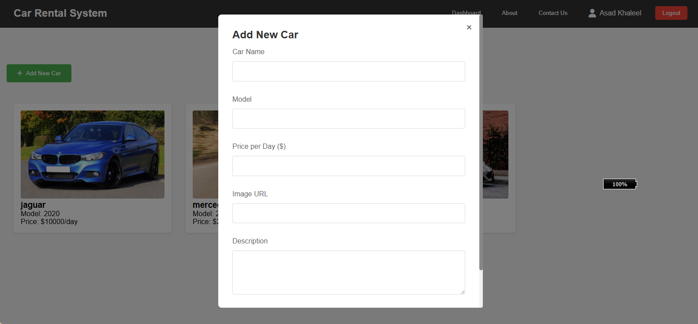
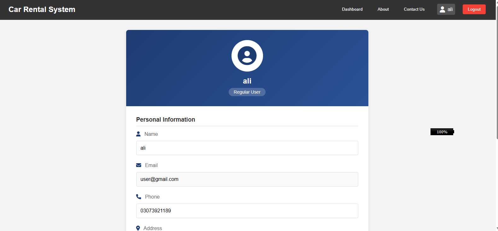

      <h1>  Car Rental System</h1>
      <h3>A Modern Vehicle Rental Management Solution</h3>

    
    
    

# 📌 Overview

A comprehensive car rental management system that simplifies vehicle bookings, rental processing, and customer management. Built with modern web technologies, this system provides an intuitive interface for both administrators and customers.

# 🛠️ Tech Stack

## 🔴 Live Demo

Check out the live demo: [Car Rental System](https://car-rental-system-aa-jamalihassan0307.netlify.app/)

## 📸 Screenshots

### System Features

#### 1. About Pages

_Overview and company information_

#### 2. Admin Interface

_Admin dashboard with vehicle management_

#### 3. Vehicle Management

_Interface for adding new vehicles to the fleet_

_Vehicle information editing interface_

#### 4. User Profiles

_Administrator profile and settings_

_Regular user profile interface_

#### 5. User Dashboard

_User dashboard with available vehicles_

#### 6. Contact

_Customer support and contact information_

## 🚀 Features

- **Vehicle Management**

  - Browse available vehicles
  - Vehicle categorization
  - Detailed vehicle information
  - Real-time availability status

- **Booking System**

  - Easy reservation process
  - Date selection
  - Duration calculation
  - Instant pricing

- **User Management**

  - Secure login system
  - User profile management
  - Booking history
  - Personal information storage

- **Admin Dashboard**
  - Vehicle fleet overview
  - Booking management
  - Customer database
  - Revenue tracking

## 🛠️ Built With

- **Frontend**

  - HTML5
  - CSS3
  - Vanilla JavaScript

- **Backend Integration**

  - RESTful API
  - JSON data handling

- **Additional Features**
  - Responsive Design
  - Interactive UI
  - Cross-browser compatibility
  - Form validation

3. Open index.html in your browser

## 🤝 Contributing

Contributions, issues, and feature requests are welcome! Feel free to check [issues page](https://github.com/yourusername/car-rental-system/issues).

## 🙏 Acknowledgments

- [HTML5](https://developer.mozilla.org/en-US/docs/Web/HTML)
- [CSS3](https://developer.mozilla.org/en-US/docs/Web/CSS)
- [JavaScript](https://developer.mozilla.org/en-US/docs/Web/JavaScript)
- [Netlify](https://www.netlify.com/) for hosting
